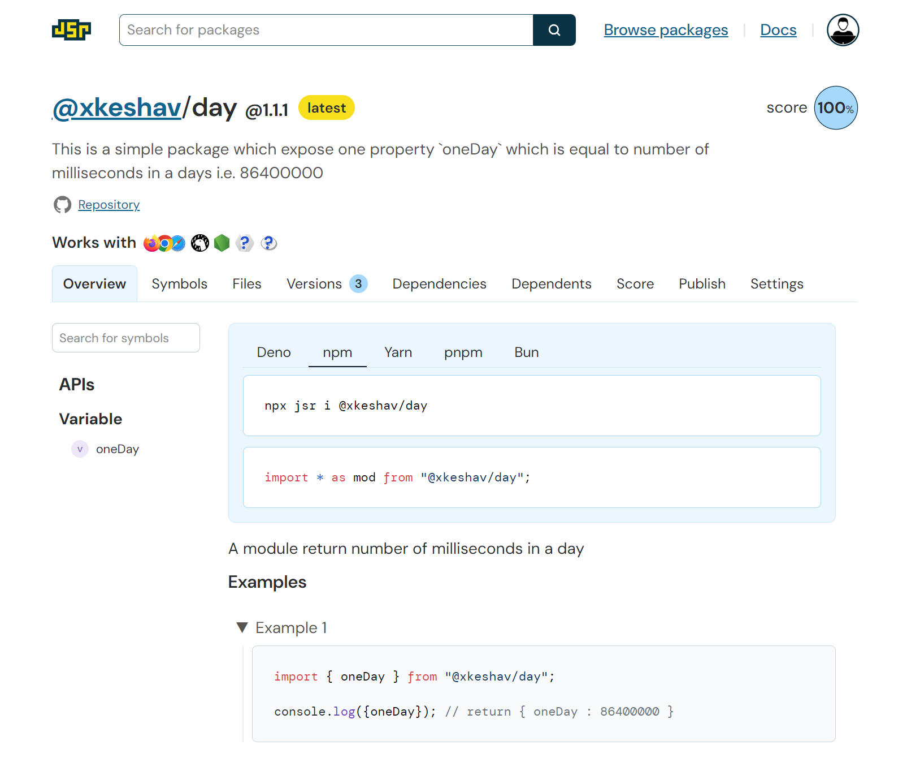

# @xkeshav/day - A JSR package

This is a minimal sample package for new package ecosystem JavaScript Registry (JSR) by Deno,
it works both in javascript and typescript.

## What this package does

this package have one property `oneDay` which return total number of milliseconds in a day i.e. 86400000

## How to run the in local

- Install Deno runtime in your system; check [deno official page](https://docs.deno.com/runtime/fundamentals/installation/)
- check Deno version using `Deno --version` ;
  below is the output from my system

```log

deno 1.41.1 (release, aarch64-apple-darwin)
v8 12.1.285.27
typescript 5.3.3

```

- Initialize deno project

```sh
deno init <project-name>
```

it will create 3 files

    - deno.json
    - main.ts
    - main_test.ts

- Run deno task

```sh
deno task server
```

task name mentioned in _deno.json > tasks_ property

open _localhost:8000_ and check

## How to install

> npx jsr i @xkeshav/day

above command will add entry in your **package.json** file as below

```json
 "dependencies": {
    "@xkeshav/day": "npm:@jsr/xkeshav__day@^1.1.1"
  }
```

## How to use

```js
import { oneDay } from '@xkeshav/day';

// named export
console.log({ oneDay });
```

## Screenshot of package



## References

- [@xkeshav/day](https://jsr.io/@xkeshav/day)
- [jsr.io](https://jsr.io/)
